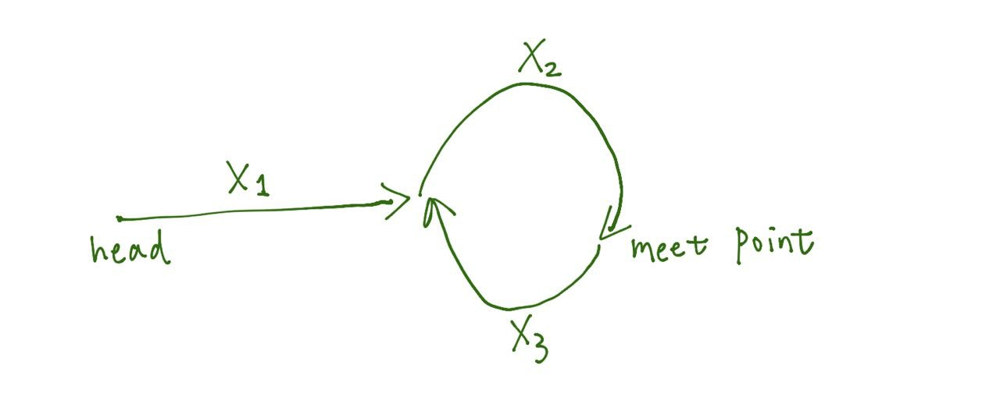

#### 142. Linked List Cycle II

给定链表，判断链表中是否存在环，如果存在的话，返回环开始的节点。


- 思路

可以使用两个变量 fast、slow，fast 每次走两个节点，slow 每次走一个节点，如果链表没有环的话，fast 最终会到达链表尾部，为空；
如果链表有环，那么 fast、slow 都会走入环中，而因为两者的速度不同，最终会使得 fast 与 slow 相遇。


当 fast 与 slow 相遇的时候，设 fast 走过的距离为 D1，slow 走过的距离为 D2，根据下图，可以得到：



```math
D1 = (X1+X2) + n*(X2+X3)

D2 = (X1+X2+X3+X2) + m*(X2+X3)

其中，2*D1 = D2，也就是：

2*(X1+X2) + 2n*(X2+X3) = (X1+X2+X3+X2) + m*(X2+X3)

=> 2*X1 + 2*X2 + 2n*(X2+X3) = X1+X2+X3+X2+m*(X2+X3)

=> X1 + 2n*(X2+X3) = X3 + m*(X2+X3)

=> X1 = X3 + (m-2n)*(X2+X3)

其中，m-2n 为正整数。
```

所以，当 fast 从 head 开始，同时 slow 在 meet point 以同样的速度进行移动，当 fast 走完 X1 距离的时候，slow 就刚好走了 `X3+(m-2n)*(X2+X3)` 的距离，也就是绕了 m-2n 圈再加上 X3 的长度，此时 fast 跟 slow 刚好相遇于环的起始节点。

我们先用第一次相遇来定位到 meet point，然后通过第二次循环，来定位到环的起始节点。


```java
class Solution {
    public int findDuplicate(int[] nums) {
        if(nums==null || nums.length==0) {
            return -1;
        }
        int fast = 0, slow = 0;
        do {
            slow = nums[slow];
            fast = nums[nums[fast]];
        } while(fast != slow);
        
        fast = 0;
        while(fast != slow) {
            fast = nums[fast];
            slow = nums[slow];
        }
        return slow;
    }
}
```