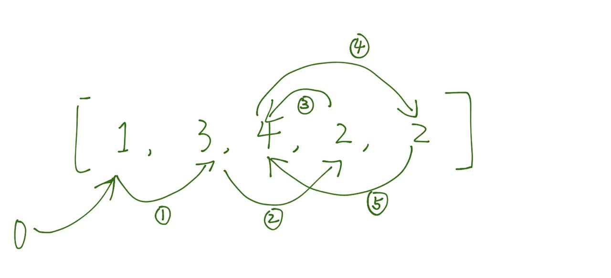

#### 287. Find the Duplicate Number

给定长度为 n+1 的数组，其中数组中每个数范围都在 [1, n]，因此必然存在某个数 k 出现了多次，并且 k 的出现次数可以大于 2。找到该重复的数字。


- 思路：寻找环的入口

以 [1, 3, 4, 2, 2] 为例，因为数组中的每个数都在 [1, n] 之间，因此我们可以把整个数组看成一个链表，下标元素 i 的下一节点坐标即为 nums[i]，例如下标 0 的元素为 1，表示其下一节点为 nums[1]=3，图示如下：



展开为链表：


开始看到，环开始的节点即为重复的数字。

那么我们可以从采用 [142 Linked List Cycle II](./142.md) 的方法找到环的开始节点，也就找到了重复的数字。

代码如下：

```java
class Solution {
    public int findDuplicate(int[] nums) {
        if(nums==null || nums.length==0) {
            return -1;
        }
        int fast = 0, slow = 0;
        do {
            slow = nums[slow];
            fast = nums[nums[fast]];
        } while(fast != slow);
        
        fast = 0;
        while(fast != slow) {
            fast = nums[fast];
            slow = nums[slow];
        }
        return slow;
    }
}
```
- 思路 2：使用二分查找定位重复数字

可以使用两个变量，high=N，low=1，然后每次统计处在 [low, mid] 之间的数字 count，

1. 如果处在 [low, mid] 之间的数字没有重复数字的话，那么 count 应该小于等于 mid-low+1，此时重复数字就在 [mid+1, high] 区间上；
2. 如果处在 [low, mid] 之间的数字存在重复数字的话，那么 count 就应该大于 mid-low+1，此时重复数字就在 [low, mid] 区间上；
3. 再对新的区间进行统计，直到 high=low 为止，此时 low 就是重复的数字。


代码如下：

```java
class Solution {
    public int findDuplicate(int[] nums) {
        if(nums==null || nums.length==0) {
            return -1;
        }
        int low = 1, high = nums.length;
        while(low < high) {
            int mid = low+(high-low)/2;
            // 统计处在 [low, mid] 区间上的数字
            int count = 0;
            for(int num : nums) {
                if(num<=mid && num>=low) {
                    count++;
                }
            }
            if(count <= (mid-low+1)) {
                low = mid+1;
            } else {
                high = mid;
            }
        }
        return low;
    }
}
```